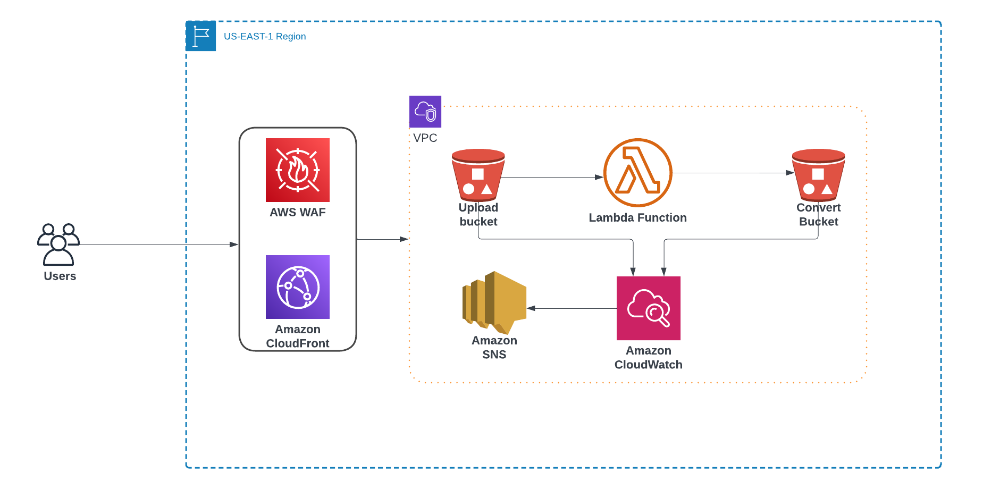

# File Conversion Service Architecture: 
 A capstone presentation for MSIS at Minot State University 

## Overview
This document outlines the architecture of a serverless file conversion service designed to automatically convert documents to different formats upon upload. The service utilizes various AWS services to handle file uploads, conversions, and notifications.

## Architecture Components

### Users
End-users interact with the system via a user interface, presumably a web application, that is not shown in the diagram.

### AWS WAF (Web Application Firewall)
Safeguards the application by monitoring HTTP/HTTPS requests and controlling access based on pre-defined web security rules.

### Amazon CloudFront
Distributes the application and content globally with low latency and high transfer speeds.

### VPC (Virtual Private Cloud)
Provides an isolated section of the AWS cloud where AWS resources like S3 buckets and Lambda functions can be launched securely.

### S3 Buckets
- **Upload Bucket**: Users upload files to be converted to this S3 bucket.
- **Convert Bucket**: The converted files are stored in this S3 bucket for retrieval or further processing.

### Lambda Function
Executes the conversion logic when triggered by new file uploads to the `Upload Bucket`. It reads the uploaded file, converts it to the specified format, and stores the result in the `Convert Bucket`.

### Amazon SNS (Simple Notification Service)
Sends notifications to subscribed endpoints or applications when the Lambda function has successfully converted a file.

### Amazon CloudWatch
Monitors and logs the activities of AWS resources, including the Lambda function. It is used for operational insight, such as tracking metrics, logging events, and setting alarms.

## File Conversion Process
1. A user uploads a file to the `Upload Bucket` via the application front end.
2. The upload triggers the Lambda Function automatically due to an event source mapping between the S3 bucket and Lambda.
3. The Lambda Function processes the file, performing the necessary conversion based on file type.
4. The converted file is stored in the `Convert Bucket`.
5. Upon successful conversion, the Lambda Function publishes a message to an SNS topic, which can be used to notify the user.
6. CloudWatch logs the operation, which can be reviewed for auditing or debugging purposes.

## Region
The service is deployed in the `US-EAST-1` AWS region, ensuring that all components are geographically close to reduce latency and improve performance.

---

**Note**: The diagram and this README do not illustrate the detailed implementation of the user interface or the security mechanisms in place for handling files and notifications.
